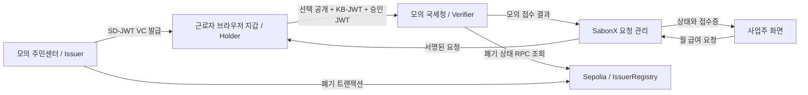

<div align="center">

# SabonX

### 주민등록증, 안전하게.

**월급 확인부터 소득 신고까지.**

[](https://211-233-200-43.nip.io/)
[](https://sepolia.etherscan.io/address/0x6c30f02f3f5e31a9a0616c5b9756d8498a6b66e5)


</div>

## 📝 프로젝트 소개
SabonX는 신분증 사본을 사장님에게 넘기지 않고, DID·VC로 필요한 정보만 증명해 월급 확인부터 소득 신고까지 연결하는 서비스입니다.

TRUST404 Track 02 해커톤 프로토타입입니다. 카페에서 정기적으로 일하는 근로자의 월 급여 확인을 중심으로, 선택적 공개·암호화된 정보 전달·온체인 폐기를 시연합니다. 실제 정부기관 연동이나 법적 신고 처리는 하지 않습니다.

[데모 사이트](https://211-233-200-43.nip.io/) · [앱 바로가기](https://211-233-200-43.nip.io/app) · [Sepolia 컨트랙트](https://sepolia.etherscan.io/address/0x6c30f02f3f5e31a9a0616c5b9756d8498a6b66e5) · [구현 상세](docs/APP-DEMO.md)

### 해결하려는 문제

급여 처리를 위해 신분증 사본 전체를 전달하면, 업무에 필요하지 않은 사진·주소 등의 정보까지 상대에게 넘어갈 수 있습니다. SabonX는 신분증 이미지 대신 발급기관이 서명한 자격증명(VC)을 사용하고, 필요한 정보만 제출하는 흐름을 제안합니다.

- 근로자는 월별 급여 내역을 확인하고 직접 서명합니다. 잘못된 금액에는 정정 메시지를 보낼 수 있습니다.
- 이름은 선택 공개하고, 주민등록번호는 모의 국세청만 복호화하도록 JWE로 봉인합니다.
- 사업주에게는 근로자 이름, 급여 요청 상태와 모의 접수 결과를 제공합니다.
- 정보 변경으로 폐기된 VC는 서명이 유효하더라도 제출 단계에서 거절합니다.

## 📱 화면 구성

| 화면 | 사용자 경험 | 연결되는 기술 |
|---|---|---|
| 랜딩 | iMessage 대화와 오른쪽 휴대폰으로 서비스 소개 | 반응형 React UI |
| 내 신원증명 | 발급·보관·재발급 | did:key, SD-JWT VC, IndexedDB |
| 사업주 요청 | 월별 급여 요청과 근로자별 처리 상태 | 서명된 요청 JWT, 역할 권한 |
| 근로자 확인 | 급여 → 공개·봉인·미전송 정보 → 승인 슬라이드 | 선택적 공개, KB-JWT, 승인 JWS |
| 정보 변경 | 이름·주소 변경 요청 | 모의 기관 자동 승인, 온체인 폐기 |
| 제출 거절 | 실제 폐기 검증 결과와 재발급 안내 | 서버 검증 응답, Etherscan 링크 |
| 접수 완료 | 양쪽 화면에서 모의 접수 결과 확인 | 서명된 접수증, 일회성 처리 |

## 🎬 데모 시나리오

기본 근로자는 **윤태호**, 사업장은 **카페 온유**, 테스트 전화번호는 `010-0000-1234`입니다. 모든 신원정보는 가상 데이터입니다.

1. **신원증명 발급**: 근로자 화면에서 VC를 발급받아 브라우저 지갑에 저장합니다.
2. **9월 급여 접수**: 사업주가 9월 급여 950,000원을 요청합니다. 근로자는 금액 → 제출 정보 → 서명 순서로 확인하고 제출합니다.
3. **10월 승진**: 사업주가 매니저 승진 후 인상된 급여로 10월 요청을 생성합니다. 금액은 직접 입력합니다.
4. **이사와 주소 변경**: 근로자가 ‘이름·주소 변경하기’에서 새 주소를 요청합니다. 모의 기관이 자동 승인하고 기존 VC의 폐기 처리가 성공하면 정보를 변경합니다.
5. **이전 VC 제출 거절**: 10월 요청의 최종 확인 화면에서 작은 ‘무시하고 제출하기’를 누릅니다. 현재 지갑의 이전 VC로 실제 서명을 만들지만, 서버의 폐기 검증에서 거절됩니다. 폐기 결과 화면에서 기록이 있는 경우 Etherscan 링크를 확인할 수 있습니다.
6. **재발급 후 접수**: 새 신원증명을 발급받고 같은 10월 요청을 다시 제출합니다. 정상 검증 후 모의 접수가 완료됩니다.

‘무시하고 제출하기’는 화면의 사전 제한만 건너뜁니다. 서버의 서명·폐기 검증을 우회하지 않습니다. 폐기와 네트워크 오류는 구분하며, 로컬 스텁에서는 온체인 확인으로 표시하지 않습니다.

### 다른 기기에서 참여하기

더보기에서 근로자 링크를 복사해 휴대폰에 전달합니다. **VC를 처음 발급하기 전에 사용할 근로자 기기에서 링크를 여세요.** 발급 후에는 해당 지갑 공개키에 연결되므로 다른 기기의 새 키로 같은 세션을 이어갈 수 없습니다.

공유 링크에는 해당 역할의 접근 권한이 포함됩니다. 근로자 링크에서도 정보 변경을 요청할 수 있지만, 사업주 권한으로는 변경할 수 없습니다. 역할 전환과 링크 인증은 데모용이며 실서비스 로그인·본인인증이 아닙니다.

## 🏗 기술 아키텍처



그림은 논리적 역할 구분입니다. 데모에서는 요청 관리·발급기관·세무 검증기가 **하나의 Node.js/Express 프로세스**에서 실행됩니다. 기관의 키가 인프라 수준에서 격리된 구조는 아닙니다.

## ⚙ 기술 스택


암호 연산에는 `jose`, `@noble/curves`, `@sd-jwt/sd-jwt-vc`를 사용합니다. 새로운 암호 알고리즘을 만든 것이 아니라, 각 기술의 보장 범위를 구분하고 하나의 업무 요청에 결합한 구현입니다.

| 기술 | 구현에서 맡는 역할 |
|---|---|
| `did:key` · Ed25519 | 공개키 기반 식별자와 전자서명. DID 자체가 실명 확인을 의미하지는 않습니다. |
| SD-JWT VC | 발급기관이 신원정보와 홀더 공개키를 서명하고, 지갑이 필요한 항목만 선택 공개합니다. |
| `cnf.jwk` · KB-JWT | VC에 연결된 개인키 소유자가 해당 nonce·수신자·제출 내용에 대해 제시했다는 것을 검증합니다. |
| JWS · 승인 JWT | 급여 요청과 제출 묶음의 해시를 결합해 승인한 내용이 바뀌지 않았는지 확인합니다. |
| JWE · X25519 | 주민등록번호를 `ECDH-ES+A256KW` / `A256GCM`으로 봉인합니다. SD-JWT의 선택적 공개와 별도 역할입니다. |
| Solidity · viem · Sepolia RPC | VC 폐기 기록을 쓰고 제출 시 현재 폐기 상태를 읽습니다. |
| React · Vite · TypeScript · CSS | 랜딩과 iPhone 형태의 앱, 급여 확인 슬라이드 UI입니다. |
| IndexedDB · idb-keyval | 사용자 기기의 브라우저에 지갑 개인키와 VC를 저장합니다. |
| Express · 메모리 Map | 역할 권한, 급여 요청, 정정 메시지, 접수 결과와 발급 메타데이터를 관리합니다. |
| Ncloud · Docker Compose · Caddy | 앱 컨테이너와 HTTPS 프록시를 운영합니다. |

## 🤔 기술적 이슈와 해결 과정

### 1. 선택적 공개와 암호화를 함께 사용하는 이유

**문제:** SD-JWT는 공개하지 않을 항목을 숨기지만, 공개한 정보를 암호화하지는 않습니다. 세무 처리 대상으로 전달할 주민등록번호에는 별도의 보호가 필요합니다.

**구현:** 발급기관은 각 선택 공개 항목을 salt와 함께 해시하고 다이제스트를 VC 본체에 넣어 서명합니다. 지갑은 이름의 Disclosure만 제출합니다. 주민번호는 모의 국세청의 X25519 공개키로 JWE 암호화하고, 암호문을 발급기관 서명이 보호하는 `rrn_sealed`에 포함합니다.

**결과:** 주소·사진 등은 제출하지 않고, 이름은 검증자가 읽을 수 있으며, 주민번호는 수신자 개인키로 복호화합니다. SD-JWT는 공개 범위를, JWE는 전달되는 값의 기밀성을 담당합니다. 데모 기관 키는 같은 프로세스에 있으므로 서버 전체에 대한 키 격리를 보장하는 것은 아닙니다.

### 2. 복사한 VC로 다른 사람이 제출하는 문제

**문제:** 발급기관 서명만으로는 지금 제출한 사람이 정당한 소유자인지 알 수 없습니다.

**구현:** 기관은 홀더 공개키를 `cnf.jwk`로 VC에 결합합니다. 지갑은 해당 개인키로 **KB-JWT**를 생성하고, 요청의 `nonce`, 수신자 `aud`, 제시 내용의 `sd_hash`를 서명합니다. 검증기는 VC에 연결된 공개키로 확인합니다.

**결과:** VC만 복사하거나 다른 키로 서명한 제출은 거절됩니다. nonce와 수신자 검증은 다른 요청에 제출 묶음을 재사용하는 것을 막습니다. 개인키 자체가 탈취되는 문제까지 해결하지는 않습니다.

### 3. 신원 제시와 특정 급여에 대한 승인을 결합하기

**문제:** 유효한 신원증명을 제출한 사실이 특정 월·금액에 동의했다는 뜻은 아닙니다. 지급 요청이나 제시 묶음을 바꿔 끼우는 공격도 막아야 합니다.

**구현:** 서버는 금액·월·사업체·근로자 공개키·nonce가 담긴 요청 JWT를 서명합니다. 브라우저는 요청 서명을 확인하고 화면 내용과 대조합니다. 이후 별도의 승인 JWT에 아래 값을 넣어 서명합니다.

```text
request_id        = 승인할 급여 요청
request_hash      = SHA-256(서명된 요청 JWT)
presentation_hash = SHA-256(SD-JWT 제시 + KB-JWT)
decision          = approve
```

**결과:** KB-JWT는 소유자 제시를, 승인 JWT는 특정 지급 요청과 제출 묶음에 대한 승인을 증명합니다. 서버는 두 서명과 요청 대상 공개키를 함께 검증합니다. 9월에 승인했더라도 금액이 달라진 10월 요청에는 새 승인이 필요합니다.

### 4. 서명이 유효한 이전 VC를 온체인 상태로 거절하기

**문제:** 주소가 바뀌어도 이전 VC의 서명은 수학적으로 유효합니다. 화면 버튼만 막아서는 서버 차원의 폐기 검증이 되지 않습니다.

**구현:** 기존 `statusIndex`를 Sepolia 컨트랙트에서 폐기하고, 트랜잭션 성공 후 정보 변경 상태를 반영합니다. 제출 시 검증기는 `revoked(statusIndex)`를 RPC로 조회합니다. 조회 실패 시에도 접수하지 않는 **Fail-closed** 정책을 적용합니다.

**결과:** ‘무시하고 제출하기’는 화면 제한만 넘고 실제 검증을 받습니다. 폐기가 확인된 경우에만 거절 결과 화면을 표시하며, RPC 장애를 폐기로 표시하지 않습니다. 새 VC를 발급받으면 기존 미완료 급여 요청에 다시 제출할 수 있습니다. 폐기는 VC의 유효성을 취소하는 것이며 개인키 자체를 삭제하는 것이 아닙니다.

### 5. 서버 VC 캐시를 제거하면서 재발급 처리하기

**문제:** 발급 결과를 서버 세션에 캐시하면 지갑 외에도 전체 VC 사본이 남습니다. 캐시를 없애면 발급 응답을 잃었을 때 기존 VC를 다시 내려줄 수 없습니다.

**구현:** 서버에는 폐기 식별자·만료 시각 등 메타데이터만 남깁니다. 발급 응답에 `Cache-Control: no-store`를 설정하고, 브라우저가 VC를 IndexedDB에 저장합니다. 재발급에서는 기존 증명을 폐기한 뒤 새 증명을 발급합니다.

**결과:** 서버 사본에 의존하는 동기화를 제거했습니다. 재발급 도중 실패해도 이미 폐기한 증명을 다시 유효하게 만들지 않습니다. 원천 가상 신원정보를 관리하는 모의 기관 데이터와 VC 사본 보관은 구분합니다.

### 6. 동시 제출과 실제 기기 시계 차이 대응

동일 요청의 동시 제출은 세션 잠금과 `pending → accepted` 상태 변경으로 한 번만 접수합니다. 정정 요청은 `correction` 상태로 바꾸어 해당 요청의 승인을 막습니다. 단일 서버 메모리 기반이므로 여러 인스턴스 운영에는 DB 트랜잭션이 필요합니다.

실기기 시연에서는 브라우저의 `iat`가 서버 시각보다 앞서 발급이 거절되는 문제가 있었습니다. JWT 검증에 **60초 Clock Tolerance**를 적용했습니다. 30초 미래 요청은 허용하고 과도한 미래·만료 요청은 거절하는 테스트로, 시간 검증 자체를 없애지 않았음을 확인합니다.

## 🔐 데이터 보관과 신뢰 경계

| 위치 | 보관 내용 |
|---|---|
| 브라우저 지갑 | 개인키, 현재 VC, 폐기 시연용 이전 VC |
| 앱 서버의 발급 메타데이터 | 공개키, 폐기 식별자, 만료 시각, 변경 상태, 폐기 이력. **전체 VC 복사본은 보관하지 않습니다.** |
| 앱 서버의 업무 기록 | 급여 요청, 이름, 정정 메시지, 처리 상태, 최소 검증 결과, 서명된 접수증 |
| 모의 기관 데이터 | 데모 발급에 사용하는 가상 신원정보와 기관 키 |
| Sepolia | 폐기 식별자와 폐기 상태·이벤트·트랜잭션 기록. 이름·주소·주민등록번호 원문은 올리지 않습니다. |

VC는 발급 응답으로 전달한 뒤 브라우저가 보관합니다. 제출된 VP·승인 토큰·복호화한 주민번호는 업무 기록에 저장하지 않습니다. 발급·검증 중 일시적으로 처리하는 것과 지속 보관은 구분합니다. 모의 기관 원천 데이터는 남아 있으므로 ‘데모 서버 전체에 주민번호가 없다’는 주장은 하지 않습니다.

개인키는 서버로 보내지 않지만, 현재는 사이트 코드가 읽을 수 있는 브라우저 내장 지갑입니다. XSS·악성 배포 코드에 대한 하드웨어 수준의 키 보호를 제공하지 않습니다. 외부 지갑 연동은 향후 확장 항목이며 현재 구현에 포함하지 않았습니다.

## 온체인 폐기 검증

- VC의 `statusIndex`는 발급기관 서명에 포함된 폐기 식별자입니다.
- 정보 변경 시 기관 권한으로 `revoke(statusIndex)` 트랜잭션을 보내고 성공을 기다립니다.
- 제출 시 서버 검증기가 `revoked(statusIndex)`를 RPC로 읽습니다. 폐기되었거나 조회에 실패하면 접수하지 않습니다.
- 조회는 `eth_call`이므로 가스비와 새 트랜잭션이 발생하지 않습니다. Etherscan 링크는 조회 자체가 아닌 **폐기 트랜잭션**을 보여줍니다.
- 블록체인은 폐기 기록을 여러 검증자가 같은 기준으로 확인하도록 사용합니다. 개인정보의 진실성이나 기관의 정직함을 자동 보장하지는 않습니다. RPC 제공자는 조회하는 식별자를 볼 수 있습니다.

## 로컬 실행

Node.js와 npm이 필요합니다. Docker 이미지는 Node.js 22를 사용합니다.

```sh
npm ci
npm run dev
```

`http://localhost:3000/app`에서 시작합니다. 체인 환경변수가 없으면 **LOCAL STUB** 폐기 목록을 사용합니다.

환경변수를 사용할 때는 `.env.example`을 `.env`로 복사해 값을 채운 다음 실행합니다.

```sh
npm run dev:local
```

| 환경변수 | 설명 |
|---|---|
| `ISSUER_SEED`, `TAX_SEED` | 기관 키의 base64url 32바이트 시드. 프로덕션에서 필수이며 재시작 시 유지합니다. |
| `CHAIN_ID` | Sepolia는 `11155111` |
| `RPC_URL`, `REGISTRY_ADDRESS` | 체인 RPC와 배포된 레지스트리 주소. 체인 ID와 함께 설정해야 온체인 경로를 사용합니다. |
| `ISSUER_CHAIN_KEY` | 폐기 쓰기 권한을 가진 기관의 체인 개인키. Sepolia 테스트 ETH가 필요합니다. |
| `SITE_ADDRESS`, `ACME_EMAIL` | Caddy HTTPS 설정 |
| `ENABLE_LEGACY_SERVER_WALLET` | 이전 실험용 서버 지갑 API를 켜는 옵션. 기본 비활성화이며 현재 앱에는 필요하지 않습니다. |

실제 `.env`와 개인키는 저장소에 커밋하지 않습니다.

## 검증 및 배포

```sh
npm run build
# 로컬 서버가 실행 중인 별도 터미널에서
npm run test:payroll
```

통합 테스트는 발급·선택 공개·접수, 잘못된 키·승인 변조·중복 제출 거절, 정정 메시지, 근로자 변경 요청과 사업주 권한 거부, 이전 VC 거절·재발급 VC 접수, 시계 오차 허용 범위를 확인합니다. 이 테스트도 연결한 서버의 데이터를 변경하므로 별도 로컬 데모 서버에서 실행하세요. 로컬 스텁 테스트 통과가 실제 Sepolia 쓰기 성공을 의미하지는 않습니다.

기존 Docker 배포의 앱만 갱신할 때:

```sh
docker compose build app
docker compose up -d --no-deps app
docker compose logs --tail=40 app
```

초기 Caddy 배포는 `.env`의 HTTPS 설정을 채운 뒤 `docker compose --profile caddy up -d --build`로 실행합니다. `/api/chain`에서 `isStub`과 체인 설정을 확인할 수 있습니다.

서버 세션은 메모리 기반이므로 재시작하면 **새 데모 시작**이 필요합니다. 브라우저 저장소와 체인 기록은 별도로 남습니다.

## 범위와 한계

- 실제 구현: 발급·서명·선택적 공개·JWE·키 바인딩·승인 결합·폐기 조회·중복 제출 차단.
- 모의 처리: 기관의 신원 확인, 이름·주소 변경 승인, 전화번호 라우팅, 세무 접수. 실제 SMS·푸시·송금·세액 계산·납부는 하지 않습니다. 요청 알림은 폴링입니다.
- 요청은 데모당 50건, 세션은 24시간 유효하며 서버당 최대 200개입니다. 운영용 영속 DB와 동시성·복구 설계는 별도로 필요합니다.
- 기관 키 격리, 기기 변경·키 복구, 실서비스 인증·인가, 공식 기관 연동과 법적 효력은 구현 범위 밖입니다.
- 지갑의 VC를 잃으면 서버 복사본을 다운로드하지 않습니다. 기존 키가 남아 있으면 이전 증명을 폐기하고 재발급합니다. 키까지 잃으면 현재 데모에서는 새 세션이 필요합니다.

## 코드 안내

- `src/ui/pages/PayApp.tsx`: 역할별 앱, 지갑 저장, 변경 요청, 폐기 거절 결과
- `src/ui/pages/PayReview.tsx`: 급여 확인·선택 공개·승인 슬라이드
- `server/payrollRoutes.ts`: 현재 앱 API와 요청 처리
- `src/issuer`, `src/holder`, `src/verifier`, `src/tax`: 발급·제시·검증·복호화
- `src/shared/revocation.ts`: 온체인 및 로컬 폐기 레지스트리
- `contracts`: Solidity 컨트랙트와 Foundry 테스트
- `scripts/payroll-test.ts`: 현재 앱 통합 테스트

실행과 시연은 이 README, 내부 흐름은 [앱 구현 문서](docs/APP-DEMO.md), 서버·컨트랙트 배포는 [배포 안내](docs/DEPLOY.md)를 참고하세요. `/legacy/*` 경로와 단계별 검증 스크립트는 기존 암호 검증 흐름을 재현하기 위해 유지합니다.

## AI 활용

초기 구현에는 Claude Code를, 현재 앱 UI·급여 승인·변경 요청·폐기 결과·테스트·문서 개선에는 OpenAI Codex를 활용했습니다. 문제 정의와 시연 방향은 사용자가 정하고, 구현 결과를 검토하며 수정했습니다.

## 문서 구성 참고

소개·화면 구성·기술 스택·기술적 이슈 구성은 [frontend README 템플릿](https://github.com/yewon-Noh/readme-template/tree/main/frontend)을 참고했습니다. 기술 설명은 SabonX의 현재 구현을 기준으로 작성했습니다.
