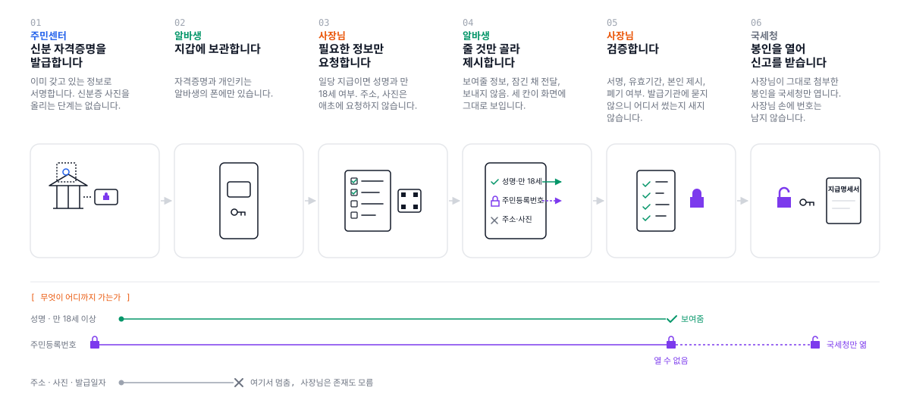

<div align="center">

# 신분증 사본 없는 일당 지급

### 사장님에게는 필요한 사실만, 주민등록번호는 국세청만 열 수 있게

[](https://211-233-200-43.nip.io)
[](https://sepolia.etherscan.io/address/0x6c30f02f3f5e31a9a0616c5b9756d8498a6b66e5)
[](/APIs.md)
<br/>
[]()
[]()

</div>

<br />

## 📝 소개

> **세금 한 푼 걷지 않는 하루짜리 알바에도 주민등록증 사본이 카톡으로 오간다.**
> **사장님은 그 번호를 국세청에 넘겨야 할 뿐인데, 원본은 사장님 손에 남는다.**

학생이 교내 행사 스태프로 하루 일하고 일당 15만 원을 받는다. 지급자는 원천징수의무자라 신고 의무가
있고, 신분증 사본과 통장 사본을 카톡이나 구글폼으로 받는다. 그런데 정작 필요한 것을 따져 보면 이렇다.

| 목적 | 실제 필요한 것 | 누가 필요한가 |
|---|---|---|
| 지급명세서 제출 | 주민등록번호 13자리 | **국세청** |
| 계좌 명의 확인 | "예금주 = 지급 대상자" 참·거짓 | 사장님 |
| 연소자 확인 | "만 18세 이상" 참·거짓 | 사장님 |

**사장님 본인이 알아야 할 정보는 하나도 없다.** 그런데 실제로 넘어가는 건 주민번호 전체 + 주소 + 사진 +
발급일자가 박힌 이미지 한 장이다.

### 왜 문제인가

1. **세금이 0원이어도 벌어진다.** 일당 18.7만 원 이하면 원천징수세액이 없다. 그런데 지급명세서는 세금이
   0원이어도 제출 의무가 있고 미제출 시 가산세가 붙는다.
2. **사장님도 피해자다.** 주민번호는 법령 근거가 있어야 수집할 수 있고, 개인정보위는 번호가 노출된 신분증
   사본 수집 자체를 피하라고 권고한다. 신고하려다 위법 소지와 보관 책임을 동시에 진다.
3. **사본은 실제로 악용된다.** KS한국고용정보 해킹(개인정보위 제재, 2026.04)으로 인사서류 약 5만 건이
   유출됐고, 그 서류가 주민등록등본·신분증 사본·통장 사본이었다.
4. **정상 요구와 사기 요구가 똑같이 생겼다.** 사기범도 "급여 지급에 필요하다"며 같은 걸 요구한다.
   지원자는 구분할 방법이 없다.

### 기존 시도와 한계

| 시도 | 한 것 | 한계 |
|---|---|---|
| 모바일 주민등록증 | 실물과 동일 효력, 제시형 인증 | 사본 보관이 필요한 업무엔 쓸 수 없다. 제시가 보관 절차를 대체하지 못한다 |
| 휴대폰 본인확인 | 주민번호 없이 실명확인 | "본인 맞음"만 준다. 지급명세서용 13자리는 못 준다 |
| 캐치시큐 등 | 사본을 **안전하게 받는** 폼 | 원본은 여전히 존재한다. 위치만 카톡방에서 관리 서버로 옮긴다 |
| 마스킹 권고 | 뒷자리 가리기 | 지급명세서엔 13자리 전부 필요하다 |
| EUDI Wallet / SD-JWT | 선택적 공개 (EU 표준) | 선택적 공개는 **이 프로젝트의 발명이 아니다.** 다만 국내 세무 절차의 "반드시 전달해야 하는 값" 문제는 다루지 않는다 |

**공통 한계**: 주민번호가 지급자 손을 거쳐야 한다는 전제를 아무도 건드리지 않았다.

### 이 프로젝트의 기여

**국세청만 열 수 있는 봉인 필드.** 자격증명 안에 주민등록번호를 국세청 공개키로 암호화해 넣는다.
사장님은 그 값을 갖고 있지만 열 수 없고, 신고할 때 그대로 첨부하면 된다.
지급자를 보관자에서 **전달자**로 되돌린다.

"안 보내기"와 "잠가서 보내기"는 다르다.

| | 주소 | 주민번호 |
|---|---|---|
| 방식 | 조각을 안 보냄 | 잠가서 보냄 |
| 사장님 | 존재도 모름 | 갖고 있지만 못 엶 |
| 국세청 | 안 감 | 열어서 봄 |

<br />

## 🎬 데모

### 👉 [https://211-233-200-43.nip.io](https://211-233-200-43.nip.io)

관객이 자기 폰으로 직접 참여하는 시연이다. 설치할 앱은 없다.

| 화면 | 누가 | 무엇 |
|---|---|---|
| [`/merchant`](https://211-233-200-43.nip.io/merchant) | 노트북 (사장님) | 사례를 고르고 요청 항목을 정한 뒤 **QR 을 띄운다**. 들어오는 제시가 목록으로 쌓인다 |
| `/wallet?m=` | 알바생 폰 | QR 로 열린다. 키 생성과 신분증 발급이 자동으로 되고, **줄 것만 골라** 제시한다 |

### 해보는 순서

1. 노트북에서 [`/merchant`](https://211-233-200-43.nip.io/merchant) 를 열고 **[QR 띄우기]**
2. 폰 카메라로 스캔 → 지갑이 열리고 신분증이 자동 발급된다 (이름은 30명 풀에서 배정, 주민번호는 더미)
3. 폰에서 **3칸**(보여줄 정보 / 잠긴 채 전달 / 보내지 않음)을 확인하고 **[제시하기]**
4. 노트북 목록에 뜬 제시에서 **[열어 보기]** → 주민등록번호는 열리지 않는다

사장님 화면에서 요청 항목을 바꾸면 폰 화면이 **그 자리에서 다시 그려진다.** 하드코딩된 목록이 아니다.

### 각 단계의 내용을 직접 보기

네 역할이 각자 페이지를 갖는다. 앞 단계 결과가 URL 로 다음 단계에 넘어간다.

[`/issuer`](https://211-233-200-43.nip.io/issuer) → `/holder?h=` → `/verifier?h=&s=` → `/tax?s=`

주민등록번호를 직접 입력해 발급받고, 조각별 salt 와 다이제스트, 봉인 헤더, 검증 결과, 봉인 해제까지
JSON 으로 확인할 수 있다. 상세는 **[APIs.md](/APIs.md)**.

<br />

## 🔍 공개 범위

이 프로젝트의 얼굴은 지갑 승인 화면의 **3칸**이다.

```
행사운영팀
일당 지급 및 원천징수 신고
─────────────────────────────
보여줄 정보
  ✓ 성명 · 홍길동
  ✓ 만 18세 이상 · 예

잠긴 채 전달 (상대는 열 수 없음)
  🔒 주민등록번호   국세청만 열 수 있음

보내지 않음
  ✗ 주소   ✗ 생년월일
─────────────────────────────
        [거부]    [제시하기]
```

같은 지급 건에서 사장님에게 남는 것을 비교하면 이렇다.

| 항목 | 지금 (신분증 사본) | 이 프로토타입 |
|---|---|---|
| 성명 | 사장님이 봄 | 사장님이 봄 |
| 만 18세 이상 | 생년월일로 사장님이 계산 | **참·거짓만** 사장님이 봄 |
| 생년월일 | 사장님이 봄 | 해시만 남음. 이름도 값도 모름 |
| 주소 | 사장님이 봄 | 해시만 남음 |
| 사진 | 사장님이 봄 | 애초에 없음 |
| 발급일자 | 사장님이 봄 | 애초에 없음 |
| 주민등록번호 | **사장님이 보고 보관** | 🔒 봉인. 국세청만 엶 |
| 보관되는 사본 | 이미지 파일 1장 | **없음** |

### 용도에 맞는 만큼만

"항상 최소만"이 아니다. 사례마다 정당하게 필요한 항목이 다르다.

| 사례 | 필요한 항목 | 왜 |
|---|---|---|
| 일당 지급 및 원천징수 신고 | 성명, 만 18세, 🔒주민번호 | 지급명세서용 번호는 국세청 몫 |
| 공모전 상금 지급 | 성명, 🔒주민번호 | 상금은 나이 제한이 없다 |
| 공공근로 채용 | 성명, 만 18세, **주소**, 🔒주민번호 | 관내 거주자만 채용 가능 |
| 주류 취급 알바 | 성명, **생년월일**, 🔒주민번호 | 청소년보호법은 만 19세 기준이라 "만 18세 이상"으로는 부족 |
| 단기 알바 면접 | 성명, 만 18세 | 지급 전이라 주민번호도 불필요 |

용도별 필요 항목을 상수로 두고, 그보다 더 요청하면 지갑에 경고가 뜬다
(`⚠ 이 용도에는 주소가 필요하지 않습니다`).

<br />

## 🗂️ APIs

👉🏻 **[API 바로보기](/APIs.md)**

<br />

## ⚙ 기술 스택

### 자격증명 · 암호


`@sd-jwt/sd-jwt-vc` (선택적 공개) · `jose` (JWE·JWS) · `@noble/curves` (Ed25519 · X25519)

### 프론트 · 서버


### 체인 · 인프라


<br />

## 🛠️ 프로젝트 아키텍처

```
주민센터(Issuer) ──자격증명──▶ 지갑(Holder) ──제시──▶ 사장님(Verifier)
                                                          │
                                              봉인 전달 ───┴──▶ 국세청 (복호화)
                     폐기 레지스트리(온체인) ◀── 조회 ──┘
```



한 저장소지만 **각 역할은 자기 키만 갖고 서로의 비밀에 접근하지 않는다.**

```
src/
  issuer/      주민센터 — 발급 서명키, 봉인 생성, 폐기 인덱스 배정
  holder/      지갑 — 홀더 키(IndexedDB), 승인 계획, 제시
  verifier/    사장님 — 검증 11개, 공개 범위 감사, KB-JWT 검증
  tax/         국세청 — 복호화 키
  shared/      did:key, SD-JWT, 봉인(JWE), 폐기 레지스트리
  ui/          랜딩, 사장님 화면, 폰 지갑, 역할 페이지 4개
server/        세션 서버, 기관 키, 역할 API
contracts/     IssuerRegistry.sol + Foundry 테스트
```

<br />

## 🤔 설계 결정

### 선택적 공개는 어떻게 동작하나

항목마다 `[salt, key, value]` 조각을 만들고 **그 해시만** 본체에 넣어 서명한다. 제시할 때 조각 원본을
같이 주면 검증자가 해시를 재계산해 대조한다. 안 준 항목은 다이제스트만 남아 **이름도 값도 알 수 없다.**

salt 가 필수인 이유: `isOver18` 처럼 값의 경우의 수가 적으면 salt 없이는 대입으로 맞힐 수 있다.

### 왜 봉인인가

선택적 공개만으로는 이 문제가 풀리지 않는다. 지급명세서에 주민번호가 **반드시** 들어가야 하므로
"안 보내기"가 선택지가 아니기 때문이다. 그래서 보내되 **받는 사람이 못 열게** 한다.

발급 시점에 주민등록번호를 국세청 X25519 공개키로 `ECDH-ES+A256KW` / `A256GCM` 암호화한다.
ECDH-ES 는 발신자가 매번 임시 키쌍을 만들어 쓰고 버리므로, **주민센터조차 봉인 후에는 다시 열 수 없다.**

> 국세청 키만 X25519 인 이유: Ed25519 는 서명 전용이라 키 합의(ECDH)를 할 수 없다. 같은 Curve25519
> 계열의 X25519 를 쓰고, did:key multicodec 만 `0xec01` 로 다르다.

### 왜 블록체인인가

**폐기 확인을 발급기관에 물어보면, 발급기관이 "이 사람이 지금 어디서 신분증을 쓰는지" 알게 된다.**
그걸 막으려고 쓴다. 발급자-검증자 비연결성이 목적이다.

체인에 올라가는 것은 **폐기 인덱스와 여부뿐이다. 개인정보는 한 글자도 없다.** 인덱스는 난수로 배정한다
(순차면 발급 순서와 시점이 드러난다). 인덱스↔사람 매핑은 발급기관만 안다.

같은 이유로 **사장님 브라우저가 서버가 아니라 RPC 를 직접 읽는다.** 서버는 발급기관 키를 들고 있어서,
서버에 물으면 같은 문제가 생긴다.

> VC·DID 는 W3C 웹 표준이다. EU 디지털 신원 지갑도 체인을 쓰지 않는다. 이 프로젝트가 체인을 쓴 곳은
> 폐기 한 군데뿐이다.

### 왜 검증이 빠른가

검증자는 **아무에게도 묻지 않는다.** 필요한 것이 전부 제시 안에 있기 때문이다.

| 검사 | 필요한 것 | 어디에 있나 |
|---|---|---|
| 발급기관 서명 | 발급기관 공개키 | `did:key` 는 식별자 자체가 공개키다 |
| 조각 해시 대조 | 조각과 본체 다이제스트 | 둘 다 제시 안에 있다 |
| 본인 제시 | 홀더 공개키 | 자격증명의 `cnf` 에 박혀 있다 |

밖에 묻는 것은 폐기 확인 하나뿐이고, 그것도 발급기관이 아니라 체인에 묻는다.
이건 성능 최적화의 결과가 아니라 **프라이버시 설계의 결과**다.

### 재사용은 어떻게 막나

자격증명의 `cnf` 에 홀더 공개키가 박혀 있다. 제시할 때 검증자가 준 nonce 에 홀더 개인키로 서명한다.
검증자마다 다른 nonce 를 주므로, 사장님이 받은 제시를 다른 곳에 복사해도 통과하지 못한다.
`sd_hash` 가 그 제시의 조각 구성 전체를 묶어서, 서명만 떼어 다른 조각에 붙이는 것도 막힌다.

<br />

## 🔒 검증 가능성

검증 결과는 화면에서 4줄로 보이고, 내부적으로는 11개 검사가 돈다.

```
✓ 주민센터 서명 확인   (발급기관 신뢰 · EdDSA 서명 · vct · 조각 해시 대조 · 레퍼런스 구현 교차 확인)
✓ 유효기간 정상
✓ 본인 제시 확인      (cnf 서명 · nonce · aud · sd_hash)
✓ 폐기 여부 확인      (온체인 조회)
```

### 공격 시연

| 공격 | 방법 | 결과 |
|---|---|---|
| 서명 위조 | 본체 JWT 한 글자 변조 | ❌ 서명 불일치 |
| 값 변조 | 조각의 value 변경 | ❌ 해시 불일치 |
| 만료 | exp 지난 자격증명 | ❌ 만료 |
| 가짜 발급기관 | 다른 키로 서명 | ❌ 신뢰 목록에 없음 |
| 재사용 | 받은 제시를 다른 검증자에게 | ❌ nonce·aud 불일치 |
| 키 위조 | 훔친 자격증명에 자기 키로 서명 | ❌ cnf 불일치 (nonce·aud 는 통과) |
| 봉인 탈취 | 봉인만 빼내 다른 키로 열기 | ❌ 복호화 실패 |
| 봉인 변조 | ciphertext 한 글자 변경 | ❌ AEAD 태그 검증 실패 |

```bash
npm run phase1   # 서명 위조 · 값 변조 · 만료 · 가짜 발급기관
npm run phase2   # 선택적 공개 — 조각 2/4만 보내도 통과, 나머지는 해시만 남음
npm run phase3   # 재사용 · 키 위조
npm run phase4   # 봉인 — 사장님은 4경로 전부 실패, 국세청만 성공
cd contracts && forge test    # 폐기 컨트랙트 6개
```

### 막지 못하는 것

- **사장님이 알게 된 "이름"을 메모하는 것.** 기술로 막을 수 없다. 대신 넘어가는 양이 이름 하나뿐이다.
- **검증자와 제3자의 실시간 중계.** `aud` 서명으로 완화만 된다. 현재 `aud` 는 요청의 `verifier` 문자열이라
  암호학적 신원이 아니다. 완전히 막으려면 검증자 DID 로 바꾸고 요청 자체에 서명해야 한다.
- **컨트랙트 소유자 키 탈취.** 폐기가 조작될 수 있다. 체인이 주는 보호의 정체는 "차단"이 아니라
  **"몰래 못 함"** 이다.

<br />

## ⚠️ 한계

이 프로토타입에서 **암호 경로는 전부 실제로 동작한다.** 가짜인 것은 양 끝의 기관 연동이다.

1. 현행 소득세법상 지급명세서에 주민번호 기재가 필요하므로, **번호를 없애는 게 아니라 사업주를 거치지
   않게 하는 것**이다.
2. 실제로 동작하려면 홈택스가 이 봉인 포맷을 수용해야 한다. 여기 국세청은 복호화 키를 든 **목업**이다.
3. 주민센터도 실제 주민등록 DB 가 없어 입력값이나 더미로 발급한다. 서명은 진짜다.
4. 세무조사 증빙으로서의 법적 인정은 별도 문제다. 실무자는 사본을 증빙으로 원하고, 서명된 자격증명이 그
   역할을 하려면 세무 당국의 인정이 필요하다. 지금은 근거가 없다.
5. 도입 주체가 소상공인이라 확산 부담이 크다.
6. **선택적 공개는 EU 표준(EUDI/SD-JWT)의 기본 기능이며 이 프로젝트의 발명이 아니다.** 기여는 봉인 필드다.
7. 세션 서버는 시연 편의용이다. 실제로는 QR·딥링크(OpenID4VP)로 지갑과 검증자가 직접 통신한다.
   서버가 nonce 를 대신 발급하고 제시를 중계하므로, 서버를 믿지 못하면 이 경로의 재사용 방지도 믿을 수
   없다. 서버는 제시를 열어 보지 않지만 중계자라는 사실은 남는다.
8. RPC 제공자는 어느 인덱스를 조회했는지 볼 수 있다. 완전한 조회 프라이버시는 아니다.
9. 홀더 키는 폰의 IndexedDB 에 있다. 실제 지갑은 보안 하드웨어를 쓴다.
10. 계좌 VC(은행 발급 → "예금주 일치" 판정 → 통장 사본도 불필요)는 설계만 했고 구현하지 않았다.

<br />

## 🤖 AI 사용 내역

이 프로젝트는 **Anthropic Claude (Claude Code)** 를 사용해 개발했다.

- **기획과 설계 결정은 사람이 했다.** 문제 정의, 봉인 필드라는 핵심 아이디어, 데이터 모델, 암호 설계,
  시연 시나리오를 `CLAUDE.md` 에 먼저 작성했다.
- **구현 코드는 대부분 Claude Code 가 작성했다.** 사람이 단계별 요구사항을 주고 결과를 검토하며 방향을
  수정했다.
- **동작 확인도 Claude Code 가 실행하고 보고했다.** 콘솔 시연, 브라우저 테스트, 체인 연동 테스트.
- **문서 초안을 Claude Code 가 작성하고 사람이 검토했다.**

세무 관련 사실관계(원천징수 세율, 지급명세서 제출 기한, 개인정보위 제재 사례)는 사람이 조사해 정리한
것을 근거로 썼다.
